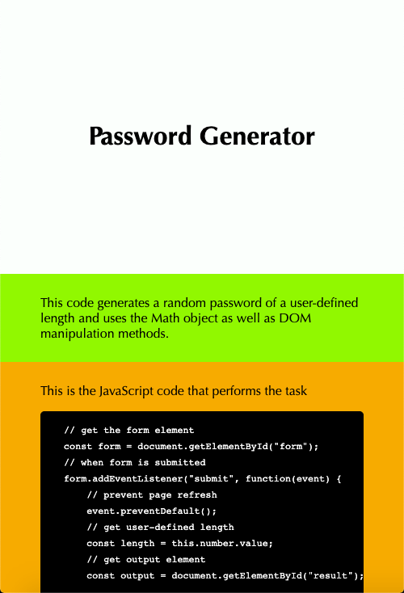
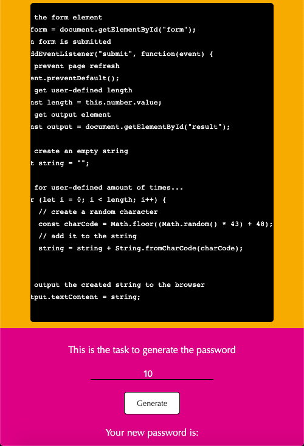
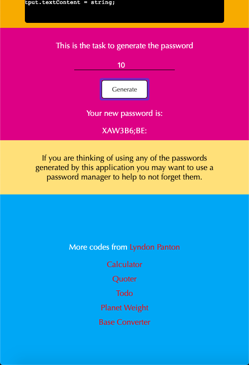
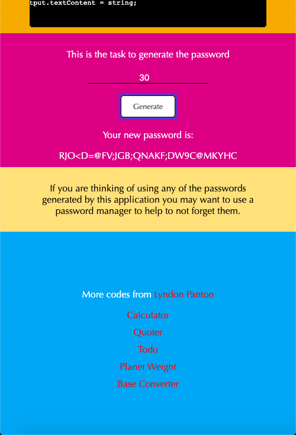

# Password Generator

## How To Open
> 1. Go to the application's download folder
> 2. Right click on the file named _index.html_
> 3. Choose the _open with_ option
> 4. Open the application in your desired browser

## How To Use
> 1. Enter a number
> 2. Press button to generate password of defined length

## Requirements
> 1. This application requires a browser to run
> 2. That browser must have JavaScript available and enabled

## User Info
> 1. Users can generate a random password
> 2. Users can choose the length of their random password

## Preview

